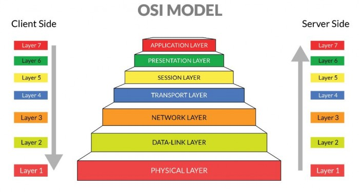
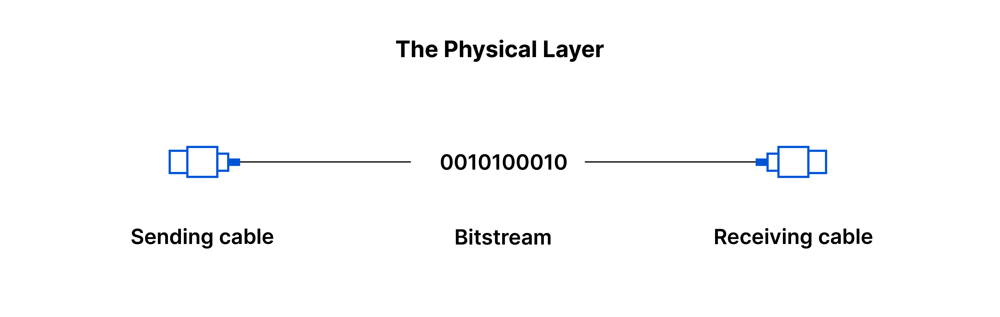
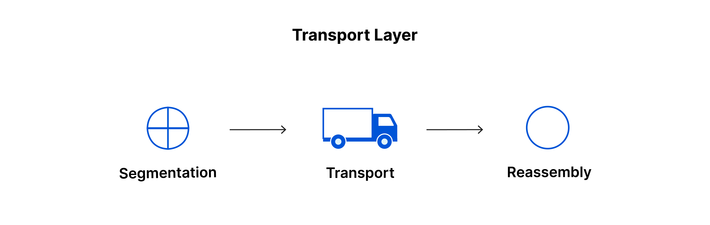

# OSI Layer

## Apa Itu OSI?

Open System Interconnection atau OSI Layer adalah standardisasi khusus yang memungkinkan berbagai komputer dapat saling berkomunikasi menggunakan protokol sesuai standarnya. Model ini dirancang oleh ISO (International Organization for Standardization).
 

## Sejarah OSI Layer

Sebelum adanya OSI Layer, sistem komunikasi antarkomputer berlangsung menggunakan protokol yang dibuat sendiri-sendiri oleh produsen dan pengembang perangkat. Ini membuat banyaknya perbedaan protokol yang ada, meski masih berada dalam satu jaringan.

Perbedaan protokol memunculkan permasalahan dalam hal komunikasi. Pertukaran informasi sulit dilakukan pada perangkat atau jaringan dengan protokol berbeda. Alhasil, sekitar akhir tahun ’70-an, dibuatlah dua proyek besar untuk menentukan protokol standar bagi semua perangkat.

Salah satu proyek digarap oleh ISO. Sementara CCITT Komisi Konsultan Komunikasi dari Prancis mengerjakan penyusunan model lainnya. Keduanya menghasilkan konsep yang menarik sehingga kemudian dilebur menjadi satu dalam Open System Interconnection (OSI) pada 1983.

OSI Layer sebenarnya dibuat agar menjadi model protokol komunikasi yang diadopsi secara internasional oleh para pengembang di bidang internet. Sayangnya hal tersebut gagal terwujud karena munculnya protokol TCP/IP hasil pengembangan Departemen Pertahanan AS. Protokol baru ini dianggap lebih efisien dalam pengaplikasiannya.

Kendati demikian, OSI Layer masih dipakai secara luas sampai sekarang, terutama dalam bidang pendidikan. Lazimnya, OSI layer digunakan untuk menjelaskan sistem kerja dan hubungan antar protokol dalam jaringan komunikasi. 

## 7 Lapisan OSI Layer

Berikut ini merupakan tujuh model OSI Layer, yang mana pada setiap lapisan mempunyai tugas dan fungsi masing-masing sesuai dengan penggunaannya terkait dengan kebutuhan koneksi antar perangkat komputer. 

### **1. Physical Layer**

Physical layer merupakan layer yang paling utama yang berfungsi untuk mendefinisikan media transmisi jaringan, sinkronisasi bit, metode pensinyalan, serta membangun arsitektur jaringan seperti Ethernet, pengkabelan, dan topologi jaringan.

Pada tahapan atau level ini juga mendefinisikan mengenai bagaimana sebuah NIC (Network Interface Card) dapat berinteraksi secara langsung dengan media kabel dan perangkat radio. Untuk setiap pengiriman data melalui tiap layer, dapat dianalogikan seperti anda mengirim surat.

Proses dalam data biner dikodekan dalam bentuk yang mampu ditransmisi melalui media jaringan. Contohnya adalah transceiver, konektor, dan kabel yang terkait dengan physical layer. Contoh lain dari peralatan atau perangkat pada lapisan 1 ini adalah hub, repeater, dan network card. 

### **2. Data-Link Layer**

Data-Link Layer memiliki tugas untuk menentukan setiap bit data dikelompokkan menjadi format yang disebut dengan frame. Pada level ini juga terjadi koreksi kesalahan, flow control, pengalamatan hardware atau perangkat keras (seperti halnya pada MAC Address (Media Access Control Address)). Serta, menentukan bagaimana perangkat jaringan seperti hub, repeater, bridge, dan switch pada layer 2 dapat beroperasi. Untuk spesifikasi IEEE 802, dapat membagi tingkatan menjadi 2 level, yaitu lapisan Media Access Control (MAC) dan lapisan Logical Link Control (LLC).

Fungsi dari LLC adalah mampu menyiapkan proses transimi kembali dari kegagalan paket saat terindikasi. Selain itu, fungsi dari lapisan MAC adalah mampu mengkoordinasikan proses akses langsung terhadap physical layer dengan metode media akses kontrolnya. Contoh dari MAC sendiri adalah Carrier Sense Multiple Access with Collision Detection (CSMA/CD), dan Carrier Sense Multiple Access with Collision Avoidance (CSMA/CA).

- **CSMA/CD** adalah metode dalam Media Access Control (MAC) yang digunakan oleh jaringan pada Ethernet. Dengan menggunakan metode tersebut, sebuah node jaringan akan mengirim data menuju node tujuan yang mempunyai tugas untuk memastikan bahwa jaringan sedang tidak dipakai untuk kebutuhan transfer lainnya. Apabila dalam tahap pengecekan terjadi tabrakan (collision) antar transmisi, maka node diharuskan untuk mengulangi permohonan (request) pengiriman dalam selang waktu berikutnya secara acak (random). Sehingga, jaringan menjadi lebih efektif dan dapat digunakan secara bergantian.
- **CSMA/CA** adalah protokol contention dalam jaringan yang dapat melakukan proses analisa kondisi jaringan komputer, supaya dapat menghindari terjadinya collision. Tidak seperti metode CSMA/CD yang menggunakan konfigurasi transmisi jaringan saat terjadi tabrakan. CSMA/CA lebih mengonsumsi traffic karena sebelum proses transmisi data, akan melakukan pengiriman sinyal melalui broadcast pada jaringan untuk mendeteksi sebuah skenario atau kemungkinan terjadinya collision.

### **3. Network Layer** 

Tugas dari network layer adalah membuat header untuk paket yang berisi informasi IP (Internet Protocol), baik IP pengirim atau IP tujuan data. Pada suatu kondisi, network layer juga melakukan proses routing melalui internetworking dengan menggunakan bantuan router dan switch pada layer ke-3.

### **4. Transport Layer** 

Transport layer mempunyai fungsi untuk memecah data menjadi paket-paket data, serta memberikan nomor urut untuk setiap paketnya. Sehingga, nantinya dapat disusun kembali saat sampai pada tujuan. Pada layer ini juga menentukan protokol yang akan digunakan untuk mentransmisikan data, seperti protokol TCP dan UDP. Protokol tersebut akan mengirimkan paket data, sekaligus memastikan bahwa setiap paket telah diterima dengan sukses dan tepat sasaran. Selain itu, juga dapat mentransmisikan ulang terhadap paket yang hilang atau rusak ketika proses pengiriman. Transport layer data dapat menyediakan transfer yang transparan dan reliable antara kedua titik akhir. Lapisan ini juga menyediakan proses multiplexing, kendali aliran (flow control), serta proses pemeriksaan error dan perbaikannya.

### **5. Session Layer** 

Session layer merupakan lapisan yang berfungsi untuk mendefinisikan bagaimana sebuah koneksi dapat dibuat, dikelola, dan dikembangkan. Contoh protokol yang berada pada session layer adalah NFS, SMB, RTP, dan lain-lain.

### **6. Presentation Layer** 

Lapisan yang keenam adalah presentation layer, dimana mempunyai fungsi untuk mentranslasikan format data yang akan ditransmisikan oleh aplikasi melalui jaringan, ke dalam format yang dapat ditransmisikan oleh sebuah jaringan. Pada layer ini, data juga akan ter-enkripsi dan dekripsi melalui sistem. Contoh protokol yang berada pada presentation layer adalah MIME, SSL (Socket Secure Layer), TLS, Redirector Software (contohnya Windows NT, Network Shell, atau Remote Desktop Protocol (RDP)), dan lain sebagainya.

### **7. Application Layer** 

Application layer adalah lapisan yang menjadi pusat (center) terjadinya suatu interaksi antara pengguna (end user) dengan aplikasi yang bekerja menggunakan fungsionalitas sebuah jaringan. Selain itu juga mempunyai fungsi untuk melakukan konfigurasi mengenai bagaimana cara aplikasi dapat bekerja menggunakan resource jaringan. Dan kemudian, dapat memberikan pesan saat terjadi sebuah kesalahan pada proses pengaturan jaringan. Contoh beberapa services dan protokol yang berada pada application layer adalah HTTP, SMTP, FTP (File Transfer Protocol), NFS, dan lain-lain. 

## Cara kerja OSI Layer:

1. Application layer akan mengirimkan data dari pengguna ke perangkat komputer penerima data.
2. pada presentation layer terjadi konversi email menjadi sebuah format jaringan.
3. Pada session layer akan membentuk sesi perjalanan data hingga seluruh proses pengiriman data selesai dilaksanakan.
4. Di dalam transport layer pengirim melakukan pemecahan data. Kemudian, data tersebut dikumpulkan pada transport layer penerima.
5. Network layer membuat alamat sehingga dapat menuntut dan mengarahkan data pada tujuan yang benar.
6. Pada data-link layer akan terbentuk data dalam bentuk frame, serta alamat fisik.
7. Pada lapisan utama, tepatnya physical layer, data akan dikirim melalui medium (perantara) jaringan menuju lapisan transport penerima.
8. Terakhir, alur proses akan berbalik dari physical layer menuju application layer. Nantinya akan mengarah pada jaringan komputer penerima.
