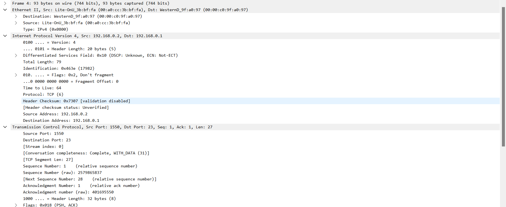
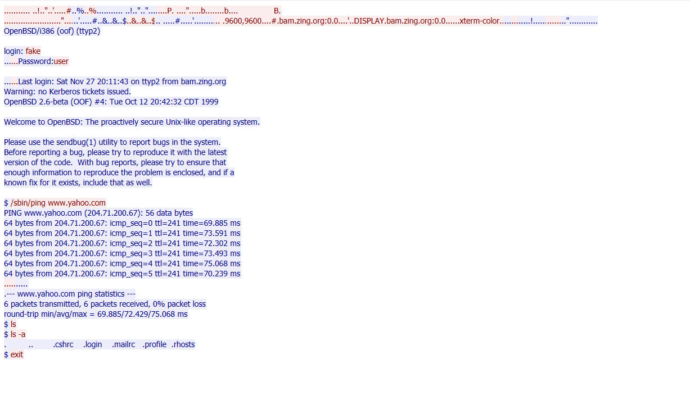
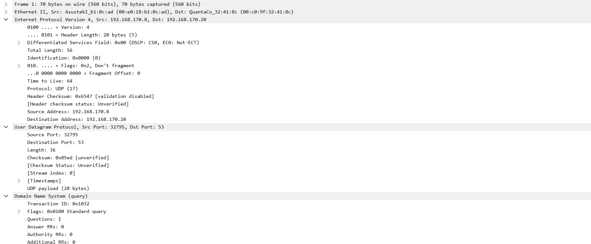

# ANALISIS DNS & TELNET CAP

## 1. Analisis Telnet.cap

Telnet adalah sebuah protokol jaringan yang umumnya digunakan untuk mengakses dan mengelola perangkat jarak jauh melalui jaringan. Biasanya, Telnet digunakan untuk mengakses shell atau lingkungan baris perintah pada perangkat jarak jauh seperti server, router, atau perangkat lain yang memiliki kemampuan koneksi jaringan.

Dalam penggunaannya, Telnet memungkinkan pengguna untuk menghubungkan diri ke perangkat jarak jauh dan berinteraksi dengan sistem tersebut seolah-olah mereka sedang berada di lokasi fisik perangkat tersebut. Pengguna dapat memasukkan perintah, menjalankan program, dan melihat output dari perangkat jarak jauh ini melalui koneksi Telnet.

<strong>Gambar 1</strong>. Gambar Wireshark untuk Telnet.cap

Dari analisis ini, kita dapat mengidentifikasi informasi header yang mencakup alamat IP pengguna (192.168.0.2) dan alamat IP server/komputer yang diakses secara remote (192.168.0.1). Selain itu, kita juga dapat mengidentifikasi port yang digunakan oleh klien (1550) dengan protokol yang bersesuaian (UDP/TCP), serta port server/pc yang diakses secara remote (23) dengan protokol (TCP) dan layanan (Telnet) yang terkait.

<strong>Gambar 2</strong>. Gambar Follow TCP Stream pada Telnet

Di Wireshark, kita juga dapat mengamati aliran data TCP atau peristiwa yang terkait dengan protokol TCP. Dalam tampilan ini, elemen yang ditandai dengan warna merah mewakili data yang dikirim oleh klien yang sedang mengendalikan server/pc, sedangkan yang berwarna biru merupakan respons yang diberikan oleh server/pc yang diakses secara remote.

## 2. Analisis DNS.cap

DNS, singkatan dari "Domain Name System" (Sistem Nama Domain), merujuk pada sistem yang digunakan dalam jaringan komputer untuk mengonversi nama domain yang bersifat lebih intuitif (seperti www.google.com) menjadi alamat IP numerik yang diperlukan oleh perangkat komputer agar dapat saling berkomunikasi di internet. DNS memungkinkan pengguna manusia untuk dengan mudah mengakses situs web atau layanan online dengan menggunakan nama domain yang mudah diingat, sementara perangkat komputer mengandalkan alamat IP untuk mengidentifikasi dan berkomunikasi dengan server yang relevan.

<strong>Gambar 3</strong>. Gambar DNS.cap pada Wireshark

Dari informasi yang terdapat di atas, kita dapat mengidentifikasi protokol Internet yang digunakan oleh klien dan server. Alamat IP klien adalah 192.168.170.8, sementara alamat IP server adalah 192.168.170.20. Selain itu, terdapat pula port yang digunakan oleh klien dan server, yaitu klien menggunakan port 32795, sedangkan server menggunakan port 53.
