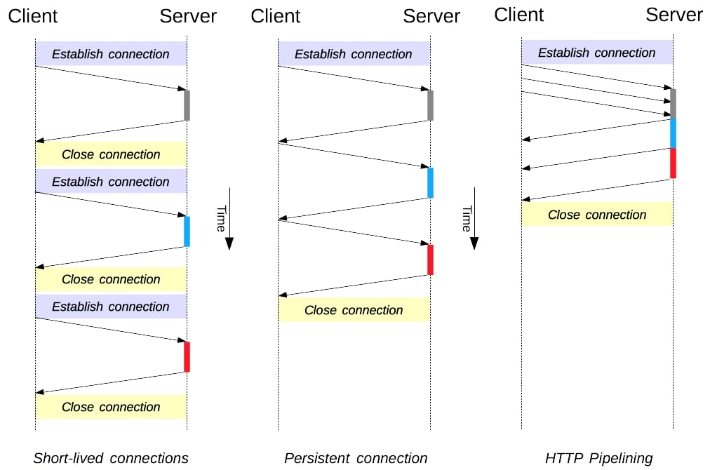

# TRANSFORMASI HTTP VERSION

| Versi HTTP | Penjelasan Transformasi                                                                                                                                                                                                                                                                                             | Contoh Penerapan                                                            | Perubahan Utama                                                                       | Keunggulan Utama                                                                                                                                              |
| ---------- | ------------------------------------------------------------------------------------------------------------------------------------------------------------------------------------------------------------------------------------------------------------------------------------------------------------------- | --------------------------------------------------------------------------- | ------------------------------------------------------------------------------------- | ------------------------------------------------------------------------------------------------------------------------------------------------------------- |
| HTTP 0.9   | - HTTP 0.9 merupakan versi HTTP awal yang sangat sederhana.   - Hanya mendukung metode GET.   - Permintaan HTTP hanya terdiri dari kata kunci "GET", alamat, dan versi protokol.                                                                                                                              | Contoh Permintaan HTTP 0.9: `GET /index.html`                               | - Tidak ada header HTTP.   - Tidak ada respons HTTP yang resmi.                    | - Kesederhanaan dan kemudahan implementasi.   - Cocok untuk pengambilan dokumen teks statis.                                                               |
| HTTP 1.0   | - HTTP 1.0 memperkenalkan fitur-fitur seperti header permintaan HTTP, berbagai metode HTTP (GET, POST, dll.), serta dukungan untuk koneksi persisten (Keep-Alive).   - Header "Host" diperkenalkan, memungkinkan server mendukung beberapa domain pada satu alamat IP.                                           | Contoh Permintaan HTTP 1.0: `GET /index.html HTTP/1.0 Host: www.google.com` | - Dukungan untuk header HTTP dan berbagai metode.   - Kemampuan koneksi persisten. | - Kemampuan mengirim permintaan HTTP yang lebih kompleks.   - Dukungan untuk beberapa domain pada satu server.                                             |
| HTTP 1.1   | - HTTP 1.1 membawa peningkatan signifikan dalam performa dan efisiensi.   - Memperkenalkan koneksi persisten secara default, mengurangi overhead pembukaan/ketutupan koneksi.   - Pipelining HTTP memungkinkan pengiriman beberapa permintaan tanpa menunggu respons sebelumnya.                              | Contoh Permintaan HTTP 1.1: `GET /index.html HTTP/1.1 Host: www.google.com` | - Koneksi persisten secara default.   - HTTP Pipelining.                           | - Kinerja yang lebih baik melalui pengurangan latensi.   - Pengiriman yang lebih efisien dengan pipelining.                                                |
| HTTP/2.0   | - HTTP/2.0 adalah versi terbaru yang menghadirkan transformasi besar.   - Menggunakan multiplexing untuk mengirim banyak permintaan/respons melalui satu koneksi.   - Menggunakan kompresi header untuk mengurangi beban bandwidth.   - Melakukan prioritisasi permintaan untuk mengoptimalkan pengiriman. | Contoh Permintaan HTTP/2.0: `GET /index.html Host: www.contoh.com`          | - Multiplexing.   - Kompresi header.   - Prioritisasi.                          | - Pengiriman yang lebih cepat melalui multiplexing.   - Penghematan bandwidth dengan kompresi header.   - Pengoptimalan pengiriman dengan prioritisasi. |

## TCP Keep-Alive dalam HTTP

<strong>Gambar 1</strong>. Perbedaan TCP Session pada Setiap Versi HTTP

TCP Keep-Alive adalah fitur yang ditemukan dalam protokol transport TCP yang digunakan oleh HTTP. Fitur ini memiliki keunggulan besar dibandingkan dengan versi HTTP sebelumnya yang tidak menggunakan koneksi persisten (Keep-Alive). Berikut penjelasan singkatnya:

### Keunggulan TCP Keep-Alive:

1. Pengurangan Latensi: Dengan TCP Keep-Alive, koneksi tetap terbuka setelah respons pertama, mengurangi latensi saat melakukan permintaan berikutnya. Pada HTTP tanpa Keep-Alive, setiap permintaan akan memerlukan pembukaan koneksi baru, yang dapat memakan waktu.

2. Efisiensi: TCP Keep-Alive mencegah overhead yang timbul dari pembukaan dan penutupan koneksi yang berulang-ulang, sehingga menghemat sumber daya jaringan dan server.

3. Optimalisasi Kinerja: Dengan koneksi yang tetap terbuka, pengguna dapat mengirimkan beberapa permintaan HTTP melalui koneksi yang sama tanpa harus membuka koneksi baru setiap saat. Ini mengoptimalkan kinerja dan efisiensi pengiriman data.

### Contoh Implementasi TCP Keep-Alive:

Saat mengakses sebuah situs web yang menerapkan TCP Keep-Alive, setelah mengambil sumber daya awal seperti halaman HTML, permintaan berikutnya seperti gambar, CSS, atau skrip JavaScript dapat diambil melalui koneksi yang masih terbuka tanpa perlu membuka koneksi baru untuk setiap unsur. Hal ini berkontribusi pada peningkatan yang berarti dalam kecepatan pengunduhan halaman web.
